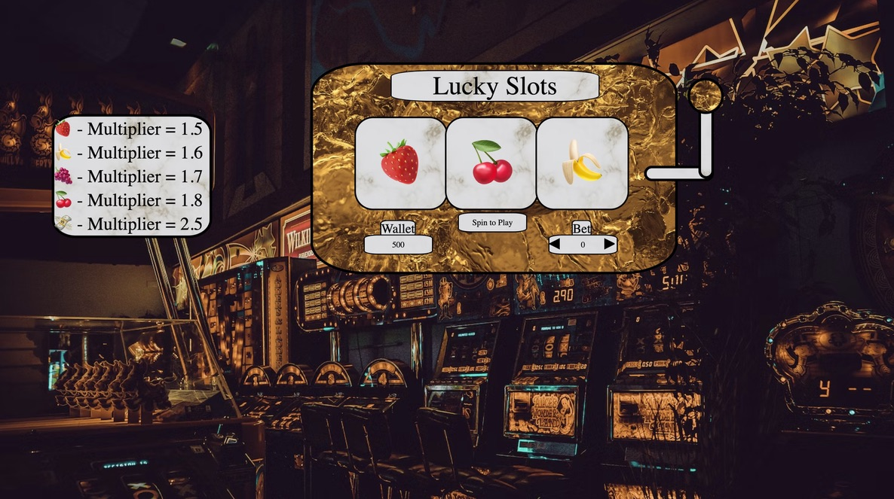

# Lucky Slots Slot Machine
- We all have come to know the world of gambling and if not all of us some of us may have dipped our hands into the exciting, but heart stopping world of betting. In this game you're going to be able to test just how lucky you are with the world's most exciting game. “The Lucky Slots.”

## Screenshots

## Technologies Used
- HTML
- CSS 
- JavaScript
- unsplash.com
- depositphotos.com
- https://animate.style/

## Getting Started 
- Link to Game: https://mattpeete1.github.io/project_1/

## Directions
1. This is a game of luck so it’s all up to how lucky you think you are!
2. You start with $500 and if you don't win anything there is no getting that money back.
3. To start the game place the bet that you want to offer up using the up arrow in the bet section
4. Once your bet is selected hit the circular nob on the right hand side of the machine
5. Once you do so the screen directly in the middle below the three wheels will either state "Try Again", "You Won Money", or "Game Over" if you have ran out of money
6. To start a new game when you run out of money the machine will state "game over", the play again button should apear.
6. The different wheel combinations will be shown on the side screen off to the left so you know what you are capable of winning.

## As a User 
- I would like to be able to bet a certain amount in $10 increments.
- I would like to have a wallet of funds.
- I would like to be able to spin the wheel.
- I would like to be able to look at a diagram to be able to see what combos give you what.
- I would like to have a play again button once I lose.
- I would like to see if I win or lose when I spin the wheel.

## Next Steps 
- I would like to add more outcomes on the wheels.
- I would like to add music in the background along with a spinning sound.
- I would like to add that different fruits have different percentages of landing on
- I would like to fix some of the issues with the betting and the wallet
- I would like to condense some of the code that is repetitive and long.
